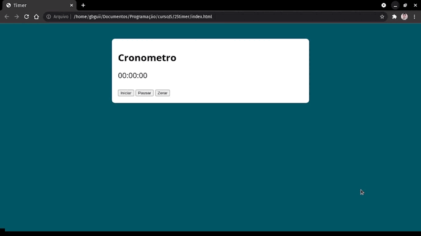

# Cronometro
## Projeto criado em JavaScript.
#### Cronômetro simples com as funcionalidades de inicar, pausar e resetar o contador.
#### Nesse projeto pude compreeender melhor as propriedades Date e setInterval dentro do Javascript, e como as manipular.

